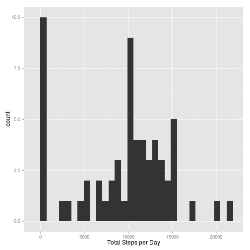
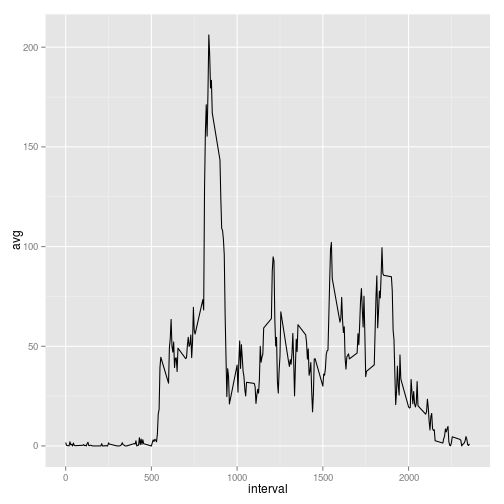
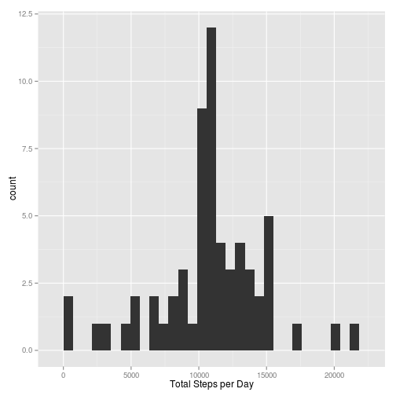
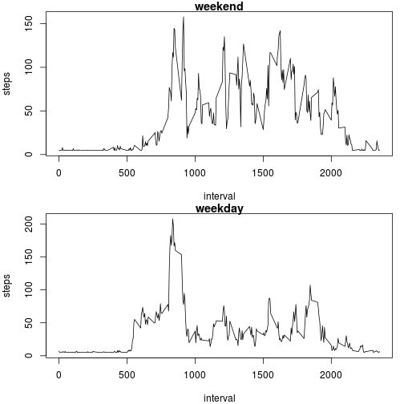

## Reproducible Research: Peer Assessment 1

Created by Carlos Alas

### Basic settings

Set Local Time language to English


```r
Sys.setlocale("LC_TIME", "C")
```

Load required packages


```r
library(dplyr)
library(ggplot2)
library(Hmisc)
```

### Loading and preprocessing the data

Loading, converting to table class and grouping by date


```r
setwd("~/Coursera/Reproducible Research/RepData_PeerAssessment1")
data <- read.csv("activity.csv")
data_df <- tbl_df(data)
by_date <- group_by(data_df, date)
```

### What is the mean total number of steps taken per day?

For this part of the assignment, you can ignore the missing values in the dataset.

1. Calculate the total number of steps taken per day

2. Make a histogram of the total number of steps taken each day


```r
total_day <- summarise(by_date, sum = sum(steps, na.rm = TRUE))
```
Histogram


```r
qplot(total_day$sum, xlab = "Total Steps per Day")
```

 

3. Calculate and report the mean and median of the total number of steps taken per day

Mean

```r
mean(total_day$sum)
```

```
## [1] 9354.23
```

Median

```r
median(total_day$sum)
```

```
## [1] 10395
```

### What is the average daily activity pattern?

1. Make a time series plot (i.e. type = "l") of the 5-minute interval (x-axis) and the average number of steps taken, averaged across all days (y-axis)


```r
by_interval <- group_by(data_df, interval)
av_interval <- summarise(by_interval, avg = mean(steps, na.rm = TRUE))
ggplot(av_interval, aes(interval, avg)) + geom_line()
```

 

2. Which 5-minute interval, on average across all the days in the dataset, contains the maximum number of steps?


```r
max <- av_interval[av_interval$avg == max(av_interval$avg),]
max
```

```
## Source: local data frame [1 x 2]
## 
##   interval      avg
## 1      835 206.1698
```

### Imputing missing values


```r
data1 <- data
data1$steps <- with(data1, impute(steps, mean))
data1_df <- tbl_df(data1)
data1_df$steps <- as.numeric(data1_df$steps)
```

Histogram


```r
by_date1 <- group_by(data1_df, date)

total_day1 <- summarise(by_date1, sum = sum(steps, na.rm = TRUE))

qplot(total_day1$sum, xlab = "Total Steps per Day")
```

```
## stat_bin: binwidth defaulted to range/30. Use 'binwidth = x' to adjust this.
```

 

Mean

```r
mean(total_day1$sum)
```

```
## [1] 10766.19
```
Median

```r
median(total_day1$sum)
```

```
## [1] 10766.19
```
As can be seen, these values do differ from the ones from the first part of the assignment.

The impact of imputing the missing data with the mean value is that the distribution of the data seems a bit more uniform.

### Are there differences in activity patterns between weekdays and weekends?


```r
daytype <- function(date) {
        if (weekdays(as.Date(date)) %in% c("Saturday", "Sunday")) {
               return("weekend")
        } else {
                return("weekday")
        }
}

data1$daytype <- as.factor(sapply(data1$date, daytype))
```

Looking at the first rows of the dataframe the new variable daytype can be seen

```r
head(data1)
```

```
##     steps       date interval daytype
## 1 37.3826 2012-10-01        0 weekday
## 2 37.3826 2012-10-01        5 weekday
## 3 37.3826 2012-10-01       10 weekday
## 4 37.3826 2012-10-01       15 weekday
## 5 37.3826 2012-10-01       20 weekday
## 6 37.3826 2012-10-01       25 weekday
```


```r
par(mfrow = c(2, 1), mar = c(4,4,1,1))
for (type in c("weekend", "weekday")) {
        steps.type <- aggregate(steps ~ interval, data = data1, subset = data1$daytype == 
                                        type, FUN = mean)
        plot(steps.type, type = "l", main = type)
}
```

 


